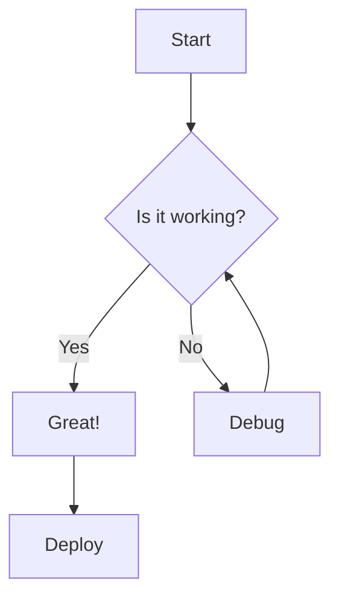
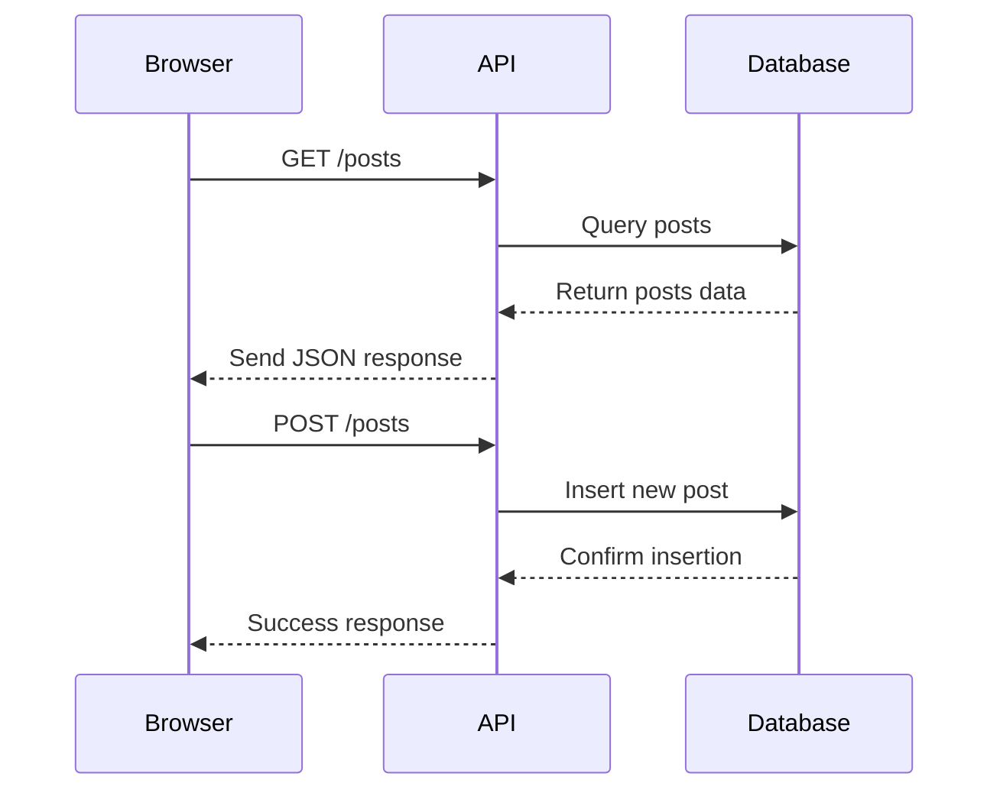
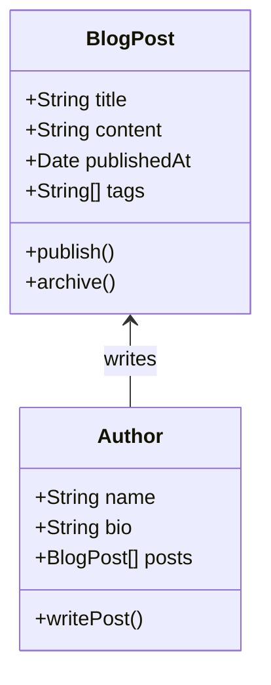
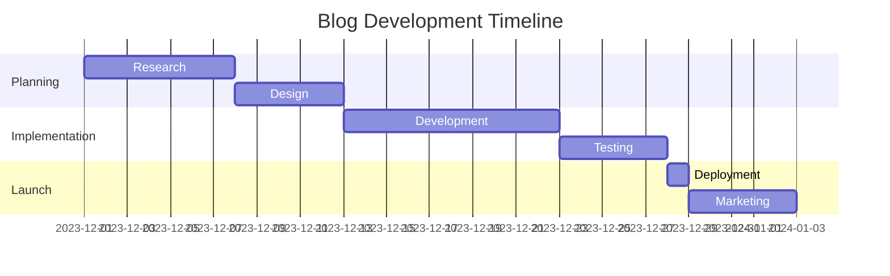
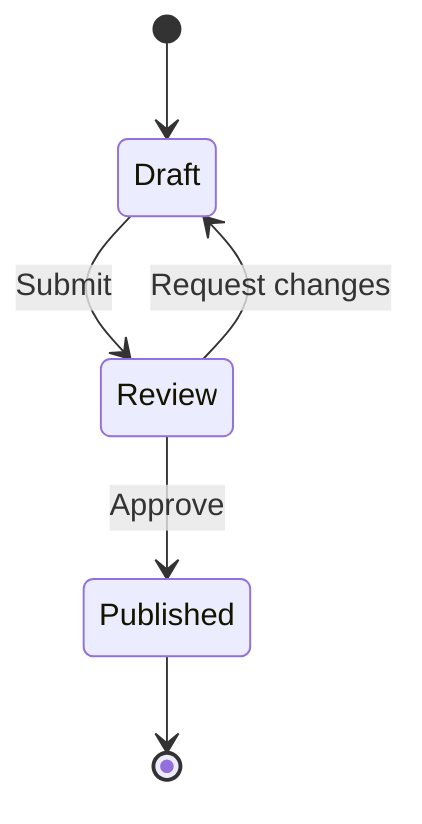
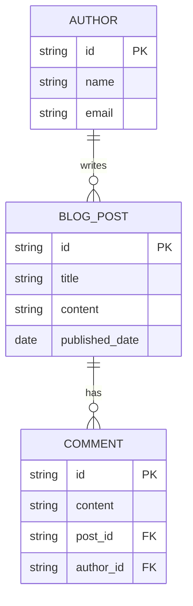
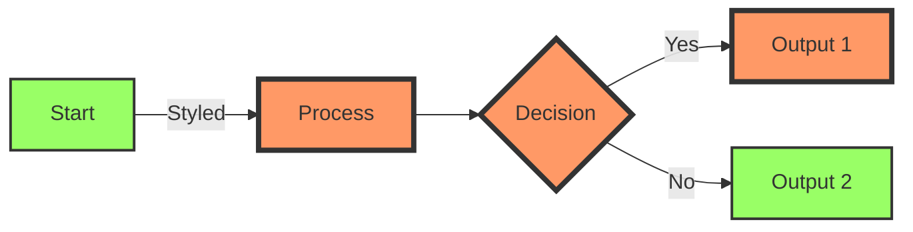

# Using Mermaid Diagrams in Blog Posts

Mermaid lets you create diagrams and visualizations using text and code. This post demonstrates how to use Mermaid in your MDX blog posts.

## Flowchart Example



## Sequence Diagram



## Class Diagram



## Gantt Chart



## State Diagram



## Entity Relationship Diagram



## Using Mermaid in Your Posts

To add Mermaid diagrams to your posts:

1. Use the `mermaid` code fence
2. Write your diagram definition
3. The diagram will be rendered automatically

## Styling Tips

You can customize the appearance of your diagrams:



## Conclusion

Mermaid diagrams are a powerful way to visualize concepts in your technical blog posts. 
```

</rewritten_file>